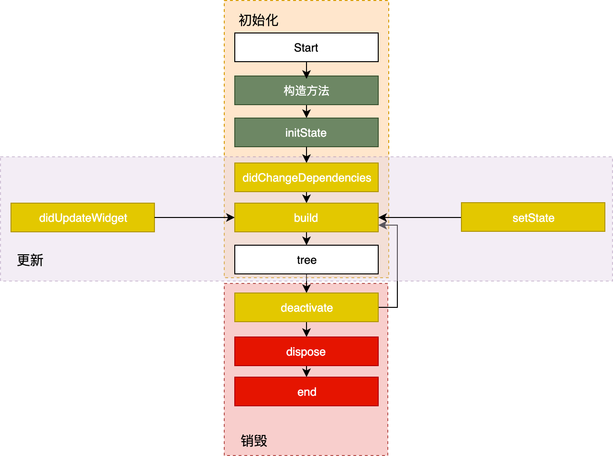

# State\(ful Widget\)

## 创建

State 初始化时会依次执行 ：**构造方法 -&gt; initState -&gt; didChangeDependencies -&gt; build**，随后完成页面渲染。

* 构造方法是 State 生命周期的起点，Flutter 会通过调用 StatefulWidget.createState\(\) 来创建一个 State。我们可以通过构造方法，来接收父 Widget 传递的初始化 UI 配置数据。这些配置数据，决定了 Widget 最初的呈现效果。
* initState，会在 State 对象被插入视图树的时候调用。这个函数在 State 的生命周期中只会被调用一次，所以我们可以在这里做一些初始化工作，比如为状态变量设定默认值。
* didChangeDependencies 则用来专门处理 State 对象依赖关系变化，会在 initState\(\) 调用结束后，被 Flutter 调用。
* build，作用是构建视图。经过以上步骤，Framework 认为 State 已经准备好了，于是调用 build。我们需要在这个函数中，根据父 Widget 传递过来的初始化配置数据，以及 State 的当前状态，创建一个 Widget 然后返回。

## 更新

Widget 的状态更新，主要由 3 个方法触发：**setState、didchangeDependencies 与 didUpdateWidget。**

* setState：我们最熟悉的方法之一。当状态数据发生变化时，我们总是通过调用这个方法告诉 Flutter：“我这儿的数据变啦，请使用更新后的数据重建 UI！”
* didChangeDependencies：State 对象的依赖关系发生变化后，Flutter 会回调这个方法，随后触发组件构建。哪些情况下 State 对象的依赖关系会发生变化呢？典型的场景是，系统语言 Locale 或应用主题改变时，系统会通知 State 执行 didChangeDependencies 回调方法。
* didUpdateWidget：当 Widget 的配置发生变化时，比如，父 Widget 触发重建（即**父 Widget 的状态发生变化时**），热重载时，系统会调用这个函数。

## 销毁

组件被移除，或是页面销毁的时候，系统会调用 deactivate 和 dispose 这两个方法，来移除或销毁组件。

* 当组件的**可见状态发生变化**时，deactivate 函数会被调用，这时 State 会被暂时从视图树中移除。值得注意的是，页面切换时，由于 State 对象在视图树中的位置发生了变化，需要先暂时移除后再重新添加，重新触发组件构建，因此这个函数也会被调用。
* 当 State 被**永久地从视图树中移除**时，Flutter 会调用 dispose 函数。而一旦到这个阶段，组件就要被销毁了，所以我们可以在这里进行最终的资源释放、移除监听、清理环境，等等。

## 相关链接

[Flutter核心技术与实战：11 \| 提到生命周期，我们是在说什么？](https://time.geekbang.org/column/article/109490)

